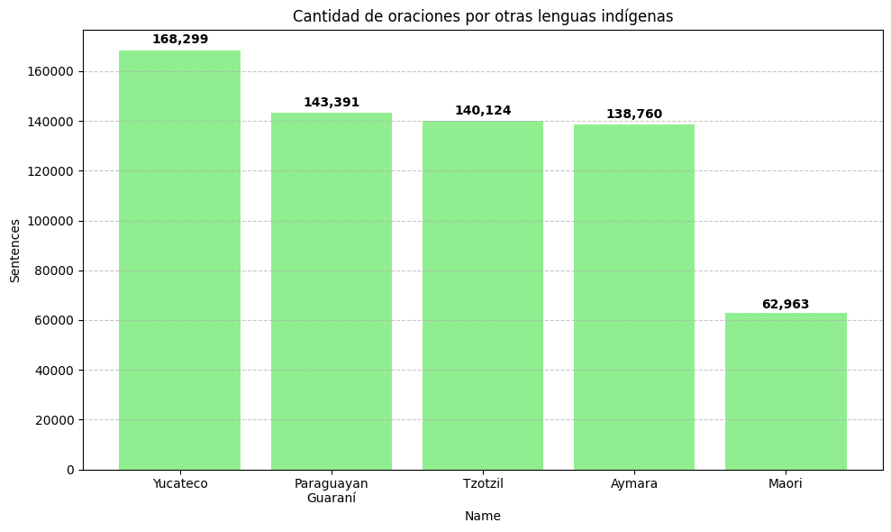

# Corpus

## Variantes del quechua

| ISO 639-3 | Nombre                                  | País      | Oraciones | Tokens    |
|-----------|-----------------------------------------|-----------|-----------|-----------|
| QUZ       | Cusco Quechua                           | Perú      | 127,408   | 1,649,454 |
| QUY       | Ayacucho Quechua                        | Perú      | 113,702   | 1,402,781 |
| QVI       | Imbabura Highland Quichua               | Ecuador   | 50,527    | 672,711   |
| QUG       | Chimborazo Highland Quichua             | Ecuador   | 20,272    | 247,947   |
| QUW       | Tena Lowland Quichua                    | Ecuador   | 15,674    | 292,905   |

## Otras lenguas indígenas

| ISO 639-3 | Nombre              | País             | Oraciones | Tokens    |
|-----------|---------------------|------------------|-----------|-----------|
| YUA       | Yucateco            | México           | 168,299   | 3,524,830 |
| GUG       | Paraguayan Guaraní  | Paraguay         | 143,391   | 2,151,216 |
| TZO       | Tzotzil             | México           | 140,124   | 2,993,791 |
| AYM       | Aymara              | Bolivia/Perú     | 138,760   | 1,939,507 |
| MRI       | Maori               | Nueva Zelanda    | 62,963    | 2,151,493 |

## Gráficos

